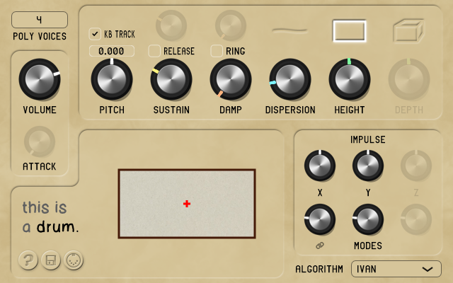
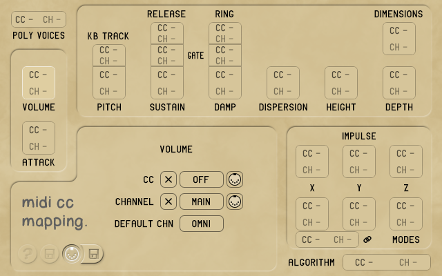
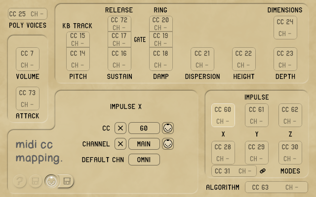

# FTMSynth

A physical modeling JUCE plugin using the Functional Transformation Method (FTM) approach, with visualization.

*Forked from [lylyhan/Thesis](https://github.com/lylyhan/Thesis), updated for real time optimization and more extensive controllability.*

## Description

FTMSynth is a software synthesizer that generates percussive sounds by modeling the vibration of physical objects — a string (1D), a rectangular drum (2D), or a cuboid box (3D). It uses the Functional Transformation Method to decompose the vibration into a set of frequency modes, each with its own pitch, amplitude, and decay rate. Those modes are summed together in real time to produce the output signal.

It provides controls to adjust the physical properties of the model, such as pitch, sustain, dampening, dispersion (inharmonicity), geometry, impulse position, and the number of computed modes. A built-in visualization displays the shape of the model as well as the impulse position.

Tweak the knobs to sculpt unique timbral characters!

> For a more technical description of the method, see chapter 4 of [lylyhan](https://github.com/lylyhan)'s paper [*"Unearthing the physicality of instrumental timbre"* [Han, 2025]](https://hal.science/tel-05169110/) (available at HAL, published under the Hal authorization v1).

### Controls

**Main controls:**

- **volume** — main volume control (linear multiplier)
- **attack** — attack smoothing (in period cycles, ranges from 0 to 2)
  - note: this knob was added as a bonus, in order not to have to rely on an external dynamics processor to tame the attack of the sound for some extreme combinations of physical parameters. This is why it is grayed out when set to 0, meaning that the sound is 100% unaltered FTM synthesis.
- **dimension** buttons (top right) — switch between 1D, 2D, and 3D models

**Timbre controls:**

- **pitch** — main pitch control (you can also double-click on the value above the knob to set it directly)
- **kb tracking** — enable/disable pitch keyboard tracking (when disabled, every input note triggers the default pitch of C4)
- **sustain** — duration of the decay
- **release** — toggles a different decay time after the MIDI note is released
  - allows the user to switch between "percussive" and "sustained" types of note control
- **damp** — dampening of the partials (bright to muffled)
- **ring** — toggles a different dampening coefficient after the MIDI note is released
  - it can be used to, for example, simulate more dampening when a note is pressed, similar to holding a finger/mallet on a drum skin after striking it
- **dispersion** — dispersion of the sound waves in the material
  - can also be referred to as "inharmonicity": a value of 0 means that partials are integer multiples of the fundamental frequency, and the higher the value, the higher and more "spread apart" the partials are
- **height** — edge length ratio for the 2D model (from thin to square)
- **depth** — edge length ratio for the 3D model (from thin to cubic)
- **impulse X/Y/Z** — the coordinates of the impulse; they can also be set by clicking on the visualization (for the 3D model, the Z coordinate can be changed with the scroll wheel)
- **modes X/Y/Z** — the number of computed modes for each dimension (the higher, the brighter/more accurate)
- **link modes** (link icon below the `modes X` knob) — toggles linking the number of modes for all three dimensions (X = Y = Z)

**Misc:**

- **polyphony voices** (top left) — maximum number of notes that can be played at the same time
- **algorithm** (bottom right) — you can choose between the following two synthesis methods:
  - **strike**: when a note is played, the model simulates an impulse at coordinates `(x [,y [,z]])` with an intensity proportional to the velocity of the MIDI note (a delta function is used as an excitation function) — similar to like a piano for the 1D model
  - **pluck**: when a note is played, the model simulates the immediate release of a displacement of a distance proportional to the velocity of the MIDI note — similar to a harpsichord for the 1D model
  - (see section 4.2 and Table 4.2 of [[Han, 2025]](https://hal.science/tel-05169110/) for more technical details)

## MIDI configuration

The button with the MIDI plug icon at the bottom left toggles the MIDI configuration tab:

In this view, each parameter is replaced with a selector that allows you to set a custom MIDI mapping for it:

- **CC** (Control Change) — the MIDI controller number to use for the selected parameter
- **channel** — the MIDI channel to use for the selected parameter (1..16) ; has the following two special values:
  - `MAIN` — listens on the default channel
  - `OMNI` — listens on any channel
- **default channel** (common to all parameters) — the MIDI channel to use as the default for all parameters (1..16, `OMNI` = any channel) ; it is also used to filter MIDI notes

Each value can be changed by holding the mouse button on the selector and dragging vertically.

The buttons on either side of the selector are:

-  — reset to default value
-  — toggle MIDI learn (has a red background when active)

*Example of MIDI mapping:*

## Loading and saving

### Presets

The **save** button at the bottom left opens a pop-up menu with the following items:

- **Init** — resets all the parameters to their default values
- **Open preset** — opens a file dialog to load a preset from a file
- **Save preset** — opens a file dialog to save the current preset to a file

The default extension for presets is `.ftmpreset`. The saving format is plain XML, and the preset file contains the values for all the patch's parameters. If some are missing, the defaults are used.

> &#x26A0;&#xFE0F; **Note:** the built-in "load/save plugin state" function saves both the preset and its MIDI mappings — which is useful for proper data persistence when used in a project in a DAW, but less so for sharing presets. In the latter case, it is preferable to use the load/save button at the bottom left.

### MIDI mapping

In *MIDI mapping* mode, there is another **save** button that appears next to the MIDI button. It opens a pop-up menu with the following items:

- **Reset MIDI mapping** — clears any controller mapping (no undo!)
- **Load MIDI mapping** — opens a file dialog to load a MIDI mapping from a file
- **Save MIDI mapping** — opens a file dialog to save the current MIDI mapping to a file

The mapping is saved in plain text to a `.xml` file containing, for each parameter, the CC numbers and channels associated to it, as well as the default MIDI listening channel.

## Build

### Requirements

- JUCE 8.0.12 with Projucer
- Windows build: MS Visual Studio 2022
- macOS build: XCode

## Credits

- [Han Han](https://github.com/lylyhan) — original concept, synthesis engines
- [Loïc Jankowiak](https://github.com/Synthesis) — optimization for real time, UI design and implementation

This project is distributed for free under the [GNU AGPLv3 license](LICENSE).
